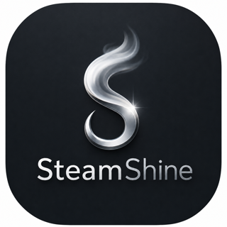

<div align="center">
  
  <h1>SteamShine</h1>
  <p><strong>Your Steam Deck, running headless, streaming at <em>your</em> screen's resolution.</strong></p>
  <p>
    
    
    
    
    
  </p>
</div>

---

No monitor. No dummy HDMI plug. No `sudo`. Close the lid on your Deck, pick it up in Moonlight from
the couch, and the game starts in a display that was created *for the device in your hands* — the
right resolution, the right refresh rate, encoded on the GPU and never drawn on a physical panel.

SteamShine is a fork of [Sunshine](https://github.com/LizardByte/Sunshine) rebuilt around one machine:
**a SteamOS box acting as a headless streaming console.**

---

## 60 seconds to your first stream

```bash
./steamshine.sh install     # download the verified release, install, autostart, and run
```

Then open **`https://<host>:47990/steamshine/`** on the phone, tablet or TV you're about to play on,
create your login, and enter the PIN from the **Pin** page into Moonlight.

That's it. No compiler, no package manager, nothing outside your home directory.

```bash
./steamshine.sh status      # is it running?
./steamshine.sh logs        # what did it say?
./steamshine.sh diagnose    # something's off — start here
```

Run `./steamshine.sh` with no arguments for a menu instead.

---

## Why this instead of stock Sunshine

|  | Sunshine | SteamShine |
| --- | --- | --- |
| Needs a display or dummy plug | Yes | **No** — it can build the display in memory |
| Session resolution | Whatever the real screen is | **Exactly what your client asked for** |
| Steam already in Game Mode | Captures the panel | **Attaches to that session** and streams it |
| Install on SteamOS | Package manager, unlock the FS | **`~/.local` only** — no `sudo`, no `pacman`, FS stays read-only |
| Control from a phone | Desktop web UI | **Touch-first panel** with live telemetry, GPU profiles, and a shell |
| Connection tuning | Fixed bitrate + FEC | **Adaptive bitrate, frame pacing, per-client profiles, loss diagnostics** |

Everything Sunshine already did well — pairing, transport, gamepad emulation, audio, the original web
UI — is still here and still works the way you expect.

---

## The virtual display

This is the heart of the fork, and it's simpler than the name suggests.

A streaming host normally captures whatever is on a real screen. SteamShine can instead start a
**private Gamescope session** — a compositor with no monitor behind it — created at exactly the size
and refresh rate your client asked for. The game runs in there, frames go straight to the GPU encoder
without ever touching a physical panel, and Moonlight receives them.

```
   Moonlight asks for 1920×1080 @ 60
              │
              ▼
   ┌───────────────────────────┐
   │  Private Gamescope        │   created at 1920×1080 @ 60
   │  (headless — no monitor)  │
   └────────────┬──────────────┘
                │  PipeWire / DMA-BUF   (no CPU copy)
                ▼
        AMD hardware encoder            Vulkan Video or VA-API
                │
                ▼
        Moonlight / Artemis
```

Two dials, and the defaults are the ones you want:

| `steamos_virtual_display_mode` | What happens |
| --- | --- |
| `off` | Stock Sunshine behaviour. Captures a real display. |
| **`auto`** *(default)* | Real display when one is genuinely capturable; otherwise a private session. |
| `force` | Always private, even with a monitor plugged in. Never falls back. |

| `steamos_session_source` | What happens |
| --- | --- |
| **`auto`** *(default)* | Attach to a verified Game Mode session if there is one, otherwise create a private one. |
| `existing_gamescope` | Only ever attach to the running Game Mode session. |
| `owned_private` | Always create a fresh private session. |

Requests from 640×480 to 7680×4320 and 30–240 Hz are negotiated, with exact rational refresh handling
(59.94 is not silently rounded to 60), and **HDR10 carries through** the headless session to the
client. If a screen *is* attached, an owned session can be mirrored to it so you can watch locally
what the remote client sees.

---

## Connection quality and stability

A stream that looks great for ten seconds and then falls apart is worse than one that never wobbles.
This is where most of the recent work went.

- **Adaptive bitrate that doesn't oscillate.** A fixed-memory controller samples every 500 ms and
  decides every 2 s, using real client loss and sender-queue pressure. Cuts are bounded (20% / 10%),
  recovery is gentle (5%), and hysteresis plus an IDR/reconnect cooldown stop it from hunting. It
  adjusts the running encoder — no recreation, no stall.
- **It remembers what worked.** The learned rate is written back into that client's profile, so the
  *next* session starts where the last one settled instead of ramping from scratch.
- **Nothing queues up behind you.** Input, capture, encoder and network queues are all bounded and
  latest-frame-wins. Under pressure you lose a frame, not half a second of latency.
- **Frames land on a clock.** Rational FPS scheduling against monotonic deadlines, with bounded
  duplicate output and per-stage interarrival statistics. A measured 60 FPS session runs ~59 FPS with
  p99 encode interarrival near 18 ms.
- **You can see the loss, per frame.** SteamShine parses Moonlight's per-frame FEC status reports —
  data and parity packets sent versus received, holes before the highest sequence number, block index.
  Guessing about "it felt laggy" is optional now.
- **When it drops, it tells you why.** Every teardown records its first cause: control ping timeout,
  protocol error, the client never establishing its video or audio endpoint, remote disconnect, local
  cleanup, service shutdown. Addresses are classified by scope (including carrier-grade NAT and
  overlay ranges) without pretending to know your network topology.
- **A blip doesn't kill your game.** By default an owned session is retained across a disconnect, so
  Moonlight's resume lands you back exactly where you were.
- **Per-client profiles that create themselves.** The first time a paired client starts a stream it is
  recorded automatically, with every policy left on automatic — so nothing changes until you want it
  to. From there you can tune geometry, FPS ceiling, codec, HDR, bitrate ceiling, quality preset,
  orientation and safe area per client *and* per network class — LAN, Wi-Fi, overlay VPN. You name the
  network class explicitly; SteamShine never guesses it from an IP address, and a changed client
  capability signature always wins over a saved preference.
- **Record what was actually sent.** The Stream page can capture the exact encoded video that went to
  the client, into a bounded capacity you set. No second encoder, no extra load — just the bitstream,
  for when you want to prove what happened.
- **Codecs are probed, not assumed.** H.264, HEVC and AV1 are advertised only after the host actually
  opens them, filtered through geometry, bit depth, latency and policy gates — with the reason visible
  when something is refused.
- **HDR10, end to end.** `off` / `auto` / `require` policy, with the requested dynamic range kept
  separate from the selected bit depth so you can always see what was asked for versus what was sent.
  Client, source, display, capture, metadata, conversion, encoder and signalling are each gated
  explicitly, and an unsafe late fallback fails closed rather than quietly handing you Main10 SDR and
  calling it HDR.

The **Stream** page shows all of it live: bitrate, frame rate, latency and packet loss as tiles you
can read at a glance, exactly what the client is receiving, how the link is holding up, and — when
the two differ — why. It polls every 2 s and never owns the media path, so nothing you do on that
page can interrupt a stream.

---

## The control panel

The original Sunshine web UI is still there, unchanged. SteamShine adds a second one at
`https://<host>:47990/steamshine/`, designed for the device in your hands rather than a desktop browser.

| Page | What it does |
| --- | --- |
| **Monitor** | CPU, RAM, GPU and VRAM tiles with rolling sparklines, per-core bars, load average and uptime, plus GPU hotspot, fan RPM and power draw against its cap. Refreshes every 2 s. |
| **Stream** | Bitrate, frame rate, latency and packet-loss tiles; exactly what the client is being sent; how the link is holding up; and recording. Per-client tuning lives behind the gear icon. |
| **Apps** | The list Moonlight clients can launch — add, edit, delete, and stop whatever is running now. |
| **GPU** | AMD power profiles. Four built-ins (Silent / Balanced / Performance / OC) scaled from what your hardware actually reports, plus custom power limit, CPU governor and clock, and GPU clock/voltage offsets where the driver exposes them. |
| **Display** | The virtual-display policy: mode, session source, local mirroring, and session retention. |
| **Pin** / **Clients** | Four-digit pairing, and revoking clients you've paired. |
| **Terminal** | A real shell on the host, in the browser, over its own WebSocket. |

Everything else stays in Sunshine's own configuration editor, one click away on every page — the
panel deliberately does not mirror settings you would only change once.

Telemetry is read straight from `/proc` and `/sys` — no `amd-smi` or `sensors` subprocess spawned
every second, and having the panel open creates no extra capture or encoder session. The control
plane is deliberately kept out of the video path: **if the web server stalls, the stream doesn't.**

---

## Safe by default

The parts worth knowing before you put this on your network:

- **It never touches what it doesn't own.** When SteamShine attaches to your Game Mode session, it
  never signals that process or removes its runtime directory. Only sessions it created are torn down.
  It will never stop your Steam for you, and it refuses launches that would start a second Steam
  instance instead of quietly making a mess.
- **It fails closed.** If a private session's socket disappears mid-stream, capture stops. It does not
  silently reconnect to your desktop and start broadcasting that instead.
- **Your system stays yours.** The installer writes only under `~/.local`, `~/.config/steamshine`,
  `~/.local/state/steamshine` and `~/.cache/steamshine`. No `sudo`, no `pacman`, SteamOS read-only
  mode is never disabled, and login lingering is deliberately not enabled. `uninstall` removes only
  what it created.
- **Releases are verified, not trusted.** `install` fetches the SteamOS x86_64 archive and its SHA-256
  from this repo's latest GitHub Release, checks the asset shape and checksum, rejects unsafe or
  linked archive entries, and installs through an immutable version store. Repeat installs are
  idempotent and the previous version stays available for `./steamshine.sh rollback`.
- **The panel is locked down.** Its own login with throttling, session cookies, CSRF tokens and a CSP.
  Config validation won't let you disable both UIs and lock yourself out. Profiles are stored
  owner-readable-only and replaced atomically.
- **Two features deserve a straight word.** The **GPU** page writes to root-owned sysfs, which it does
  by raising a single capability (`CAP_DAC_OVERRIDE`) around each individual write and dropping it
  immediately after — against an allow-list resolved from real sysfs enumeration, with every value
  clamped to the range the hardware reports. The **Terminal** is a genuine shell running as the same
  unprivileged user as the service: convenient, and roughly equivalent to leaving SSH open. Both sit
  behind the same authentication as everything else, but decide for yourself whether you want them
  reachable on your network. The panel can be turned off entirely with `steamshine_web_ui_enabled`.

---

## Requirements

- **SteamOS 3.8**, or a comparable Arch-based Linux, on x86_64. SteamOS 3.8.16 is the measured baseline.
- **An AMD GPU.** Capture, encode and the GPU page are all built around `amdgpu`.
- **Gamescope** (with `--backend headless` and `--prefer-vk-device`, which SteamOS 3.8 ships) and
  **PipeWire**, for the virtual display. Without them the rest still runs.
- **A Moonlight or Artemis client** on whatever you plan to play on.

`./steamshine.sh compatibility-check` verifies all of the above — worth running after any SteamOS update.

---

## The settings that matter

Set these from the panel's **Virtual display** page, or in your Sunshine config file:

| Key | Default | Meaning |
| --- | --- | --- |
| `steamos_virtual_display_enabled` | `true` after `install` | Master switch for everything above. |
| `steamos_virtual_display_mode` | `auto` | `off` / `auto` / `force`. |
| `steamos_session_source` | `auto` | `auto` / `existing_gamescope` / `owned_private`. |
| `steamos_local_presentation` | `auto` | Mirror an owned session to an attached screen. |
| `steamos_keep_session_alive` | `true` | Retain an owned session across a disconnect. |
| `steamshine_web_ui_enabled` | `true` | Serve the SteamShine panel. |
| `steamshine_web_ui_default` | `false` | Put the panel at `/` instead of Sunshine's UI. |

GPU selection (`steamos_game_gpu`, `steamos_capture_gpu`, `steamos_encoder_gpu`), the Gamescope path,
timeouts and default display size are configurable too. Left blank, GPU selection picks the AMD render
node with the most dedicated VRAM and refuses to guess when two candidates are ambiguous.

Other commands: `check`, `compatibility-check`, `autostart-status`, `build`, `configure`, `restart`,
`update`, `repair`, `rollback`, `hardware-test`, `uninstall`. Every modifying command accepts
`--dry-run`. Full reference in [STEAMOS_SETUP_SCRIPT.md](docs/STEAMOS_SETUP_SCRIPT.md).

---

## Project status

An honest summary, because it should affect whether you install this today.

**SteamShine works.** The virtual-display pipeline — headless Gamescope, PipeWire discovery, DMA-BUF
capture, Vulkan encoding, video, audio, touch and mouse input, and session retention across
disconnects — has been validated end to end on real hardware (SteamOS 3.8.16, RX 9070 XT), including
ten cable disconnect/reconnect cycles. CI covers formatting, linting, build, lifecycle tests,
packaging and installer smoke tests on every change.

Still outstanding, stated plainly:

- Keyboard and gamepad input, fully monitorless operation, and explicit-stop cleanup are pending a
  final hardware acceptance pass.
- Attaching to a **Game Mode** session needs its own acceptance run; the Desktop Mode result doesn't
  substitute for it.
- Adaptive bitrate, per-client profiles and the Stream page are implemented and unit/CI tested, but
  their controlled-loss and live-browser acceptance runs are still pending.
- The GPU *write* path and the Terminal WebSocket haven't yet been exercised on live hardware.
- Testing has concentrated on one host and one GPU. Other AMD hardware should work; nobody has proven
  it yet.

If you want a mature, broadly-tested host on any OS, install upstream Sunshine — it's excellent. If
you have a SteamOS machine you want to run headless and you don't mind being early, this is built for
exactly that, and reports from other hardware are genuinely useful.

---

## Documentation

| Document | Contents |
| --- | --- |
| [INSTALLATION.md](docs/INSTALLATION.md) | Install paths and artifact verification. |
| [STEAMOS_SETUP_SCRIPT.md](docs/STEAMOS_SETUP_SCRIPT.md) | Every `steamshine.sh` command and exit code. |
| [TROUBLESHOOTING.md](docs/TROUBLESHOOTING.md) | When it doesn't come up cleanly. |
| [STEAMOS_AUTO_VIRTUAL_DISPLAY_IMPLEMENTATION.md](docs/STEAMOS_AUTO_VIRTUAL_DISPLAY_IMPLEMENTATION.md) | How the virtual display actually works. |
| [STREAM_NEGOTIATION_HDR_QUALITY_DESIGN.md](docs/STREAM_NEGOTIATION_HDR_QUALITY_DESIGN.md) | Negotiation state, geometry, codecs, HDR, VBR and adaptive bitrate. |
| [STREAM_PROFILES_UI.md](docs/STREAM_PROFILES_UI.md) | Exact stream-profile matching and the four-stage Stream UI. |
| [IMPLEMENTATION_STATUS.md](docs/IMPLEMENTATION_STATUS.md) | Per-feature status, in more detail than above. |
| [PROJECT_ROADMAP.md](docs/PROJECT_ROADMAP.md) | Feature order, PR boundaries, hardware gates, rollback. |

---

## Relationship to Sunshine

SteamShine began as a fork of [LizardByte/Sunshine](https://github.com/LizardByte/Sunshine) and reuses
a great deal of it. It is developed independently at
[souten-yd/SteamShine](https://github.com/souten-yd/SteamShine) and does not currently track upstream
releases.

To pull a specific upstream change in yourself: the files most likely to conflict are the ones this
fork modified heavily (`src/confighttp.cpp`, `src/config.*`, `src/stream.*`,
`src/platform/linux/misc.cpp`, the Linux packaging scripts). The SteamOS-specific files
(`src/steamos_virtual_session*`, `src/steamshine_*`, `src/adaptive_bitrate.*`, and the
`src_assets/common/assets/steamshine/` panel) don't exist upstream and won't conflict at all.

Sincere thanks to the Sunshine and Moonlight projects — none of this would exist without them.

## License

GPL-3.0, the same as upstream Sunshine. See [LICENSE](LICENSE).
